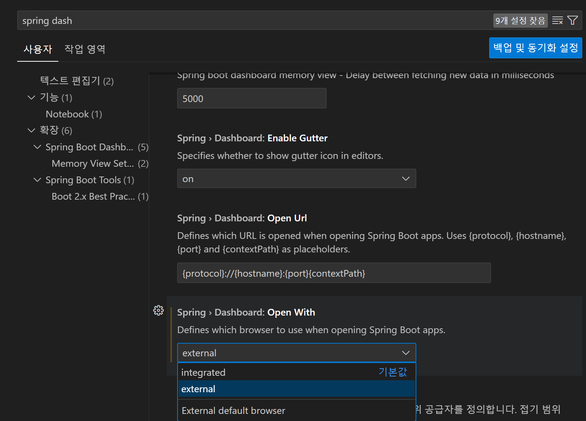

# 개발 환경 설정, 프로젝트 생성

1. vscode로 진행
2. Extension 설치

- Spring Boot Extension Pack, Lombok, Mybatis, XML, Gradle, Spring Boot Developer Extension Pack, thymeleaf

3. 스프링 부트 대시보드 외부 브라우저 설정
   

# 프레임워크(Framework)란?

- 소프트웨어 개발을 간소화하고 체계화하기 위해 설계된 표준화된 코드 구조와 규칙의 집합(개발자가 특정 애플리케이션이나 시스템을 개발할 때 필요한 기반을 제공하며, 공통적으로 사용되는 기능들을 미리 구현하여 반복적인 작업을 줄이고 효율성을 높이는 데 기여)

1. 프레임워크의 주요 특징

- 재사용성 : 프레임워크는 공통적으로 필요한 기능을 포함하고 있어, 동일한 코드를 반복 작성하지 않아도 된다. 이를 통해 코드의 재사용성을 높이고 생산성을 향상시킬 수 있다.
- 표준화 : 개발 과정에서 일정한 규칙과 구조를 제공함으로써 코드의 일관성과 가독성을 높인다.
- 제어 역전 : 프레임워크는 제어의 흐름을 개발자 대신 관리한다. 즉, 개발자는 프레임워크의 규칙을 따르며 필요한 기능만 구현하면 된다.
- 확장 가능성 : 기본적으로 제공되는 기능 외에도 개발자의 요구에 따라 추가적인 기능을 확장하거나 커스터마이징할 수 있다.
- 커뮤니티와 문서화 : 대다수의 프레임워크는 방대한 사용자 커뮤니티와 잘 작성된 문서를 가지고 있어, 개발 중 발생하는 문제를 해결하는 데 유리하다.

2. 웹 개발 프레임워크의 종류

- Frontend : React.js, Angular, Vue.js
- Backend : Django(Python), Express.js(Node.js), Spring(Java), Ruby
